# TCGscanner

Visual card recognition for trading card games, with Riftbound as the first evaluation domain.

The project is a reproducible scanner prototype: it detects a physical card from a mobile/web camera frame, normalizes the card crop, represents it as a visual embedding, and searches a local vector index for the closest card in the reference catalog.

The current implementation intentionally avoids OCR as the primary recognition mechanism. OCR can be useful as an auxiliary signal, but card photos are often sleeved, tilted, partially lit, affected by glare, printed in different languages, or captured with motion blur. This repository treats recognition as a visual retrieval problem instead:

1. YOLO detects the card boundary.
2. The card crop is normalized to a stable image.
3. SigLIP 2 converts the normalized image into a visual embedding.
4. LanceDB retrieves nearest neighbors from the local card index.
5. Pricing is resolved separately so recognition stays fast.

## Architecture

The system separates detection from identification:

- **Object detection:** a single-class YOLO model detects `card` regions in camera frames.
- **Visual retrieval:** `google/siglip2-base-patch16-384` maps card images into an embedding space.
- **Vector database:** LanceDB stores reference embeddings and metadata locally.
- **Runtime scanner:** the UI streams lightweight preview frames for live detection and sends a higher-quality capture for final recognition.
- **Auditability:** detector version, embedding model, preprocessing version, index version, latency, and recognition logs are tracked in the pipeline.

A visual embedding is a numerical representation of an image in a high-dimensional vector space. The model is not asked to output a card name directly. Instead, visually similar images should produce nearby vectors. That makes card identification a nearest-neighbor search problem against a curated reference catalog.

```mermaid
flowchart LR
    %% Riftbound / TCG Visual Scanner Architecture

    subgraph offline["Offline Training and Indexing"]
        direction LR

        subgraph detector_training["Detector Training Pipeline"]
            direction LR
            ds["Universal TCG Dataset<br/>MTG, Pokemon, Grand Archive, others"]:::data
            clean["Cleaning and Filtering<br/>remove non-representative samples"]:::data
            yolo_fmt["YOLO Annotation Format<br/>bbox from corners / polygons"]:::data
            aug["Data Augmentation<br/>blur, lighting, perspective, scale"]:::training
            train["YOLO Card Detector Training<br/>single class: card"]:::training
            eval["Evaluation Metrics<br/>precision, recall, mAP50, mAP50-95"]:::training
            registry["Model Registry<br/>detector version + training metadata"]:::registry

            ds --> clean --> yolo_fmt --> aug --> train --> eval --> registry
        end

        subgraph reference_index["Reference Catalog Indexing"]
            direction LR
            catalog["Riftbound Reference Catalog<br/>metadata + official images"]:::data
            ref_pre["Reference Preprocessing<br/>stable 384 x 384 input"]:::embedding
            ref_embed["SigLIP 2 Visual Embeddings<br/>one vector per card"]:::embedding
            vdb[("LanceDB Vector Index<br/>embeddings + card metadata")]:::database

            catalog --> ref_pre --> ref_embed --> vdb
        end
    end

    subgraph online["Online Live Scanner"]
        direction LR
        camera["Mobile / Web Camera"]:::runtime
        preview["Lightweight Detection Frames<br/>compressed preview stream"]:::runtime
        detector["YOLO Card Detector<br/>loaded from registry"]:::training
        overlay["Bounding Box Overlay<br/>live visual feedback"]:::runtime
        stable["Stable Detection Trigger<br/>card boundary confirmed"]:::runtime
        capture["High-Quality Capture<br/>preserve recognition detail"]:::runtime
        crop["Crop and Normalize<br/>detected card region"]:::embedding
        query_embed["SigLIP 2 Query Embedding<br/>photo to vector"]:::embedding
        search["Nearest-Neighbor Search<br/>similarity over vector index"]:::database
        match["Ranked Card Match<br/>card id, set, confidence"]:::runtime
        ui["UI Result<br/>match first, enrichment later"]:::runtime
        price["Async Price Lookup<br/>PriceCharting / future providers"]:::external

        camera --> preview --> detector --> overlay --> stable --> capture --> crop --> query_embed --> search --> match --> ui
        match -. non-blocking .-> price -. enrich .-> ui
    end

    subgraph audit["Audit and Observability"]
        direction LR
        dataset_version["Dataset Version"]:::audit
        detector_version["Detector Version"]:::audit
        embedding_version["Embedding Model Version"]:::audit
        preprocessing_config["Preprocessing Config"]:::audit
        index_version["Index Version"]:::audit
        latency["Latency Metrics"]:::audit
        logs["Recognition Logs"]:::audit

        dataset_version --- detector_version --- embedding_version --- preprocessing_config --- index_version --- latency --- logs
    end

    registry --> detector
    vdb --> search

    ds -. versioned by .-> dataset_version
    registry -. versioned by .-> detector_version
    ref_embed -. versioned by .-> embedding_version
    ref_pre -. config .-> preprocessing_config
    vdb -. versioned by .-> index_version
    search -. measured by .-> latency
    match -. recorded in .-> logs

    subgraph legend["Legend"]
        direction TB
        legend_data["Data / Dataset"]:::data
        legend_training["Training / Model Lifecycle"]:::training
        legend_embedding["Embedding / Preprocessing"]:::embedding
        legend_database["Vector Database"]:::database
        legend_runtime["Runtime Scanner"]:::runtime
        legend_external["External Provider"]:::external
        legend_audit["Audit / Observability"]:::audit
        legend_registry["Model Registry"]:::registry
    end

    classDef data fill:#dbeafe,stroke:#2563eb,color:#0f172a,stroke-width:1px
    classDef training fill:#ede9fe,stroke:#7c3aed,color:#0f172a,stroke-width:1px
    classDef embedding fill:#dcfce7,stroke:#16a34a,color:#0f172a,stroke-width:1px
    classDef database fill:#ccfbf1,stroke:#0f766e,color:#0f172a,stroke-width:1px
    classDef runtime fill:#ffedd5,stroke:#ea580c,color:#0f172a,stroke-width:1px
    classDef external fill:#fee2e2,stroke:#dc2626,color:#0f172a,stroke-width:1px
    classDef audit fill:#f1f5f9,stroke:#64748b,color:#0f172a,stroke-width:1px
    classDef registry fill:#fef3c7,stroke:#d97706,color:#0f172a,stroke-width:1px
```



More detail:

- [`ARCHITECTURE.md`](ARCHITECTURE.md)

## Requirements

- Python `3.12+`
- [`uv`](https://docs.astral.sh/uv/)
- Network access for the first setup run
- Optional: Apple Silicon MPS, CUDA, or CPU for embedding inference

The YOLO detector is not committed to git. It is downloaded from Hugging Face during setup:

```text
https://huggingface.co/Adrihp06/TCGscanner-detector
```

## Hardware and Runtime Notes

The prototype was developed and measured on:

| Component | Development environment |
| --- | --- |
| Machine | MacBook Pro |
| Chip | Apple M5 Pro |
| CPU cores | 15 cores: 5 efficiency + 10 performance |
| GPU | Integrated Apple M5 Pro GPU, 16 cores, Metal 4 |
| Memory | 24 GB unified memory |
| OS | macOS / Darwin arm64 |
| Acceleration used by embeddings | PyTorch MPS when available, otherwise CPU |

Minimum practical backend requirements:

| Use case | Suggested minimum |
| --- | --- |
| Run the HTTP backend and static UI | Python 3.12, 8 GB RAM |
| Run visual recognition with SigLIP 2 on CPU | 16 GB RAM recommended |
| Run live camera demo comfortably | Apple Silicon M-series, CUDA GPU, or modern CPU with enough thermal headroom |
| Build the full local vector index | 16 GB RAM recommended and several GB of free disk/cache space |
| Train the YOLO detector | Dedicated GPU recommended; CPU training is not practical for iteration |

Observed warm inference/retrieval timings on the development machine:

| Measurement | Result |
| --- | ---: |
| SigLIP 2 warm embedding p50, PriceCharting eval | ~44.46 ms |
| SigLIP 2 warm embedding range, PriceCharting eval | ~38.97-51.12 ms |
| End-to-end warm visual retrieval p50, PriceCharting eval | ~50.91 ms |
| End-to-end warm visual retrieval p95, PriceCharting eval | ~55.63 ms |
| End-to-end warm visual retrieval p50, synthetic official-image eval | ~57.04 ms |
| End-to-end warm visual retrieval p95, synthetic official-image eval | ~60.47 ms |

The first request in a fresh process is much slower because it loads model weights and initializes the backend. The numbers above exclude that cold-start path and are the relevant figures for a warm local server.

Training notes for the current YOLO detector:

| Experiment | Status | Epochs completed | Test mAP50 | Test mAP50-95 |
| --- | --- | ---: | ---: | ---: |
| `localization_only` | completed | 80 | 0.9950 | 0.9141 |
| `hybrid` | stopped manually during epoch 42 | 41 | 0.9950 | 0.9635 |

The training audit did not record wall-clock training duration, so the repository reports epoch counts and evaluation metrics rather than an estimated elapsed time. Future training runs should record hardware, start/end timestamps, batch size, image size, and per-epoch duration in the audit output.

## Quickstart

Install dependencies:

```bash
uv sync
```

Prepare a full local setup:

```bash
uv run python scripts/setup_project.py
```

That command:

1. downloads the current YOLO ONNX detector to `models/riftbound_regions.onnx`;
2. imports official Riftbound metadata and card images;
3. builds the local LanceDB vector index under `data/vector_db/`.

For a fast smoke test:

```bash
uv run python scripts/setup_project.py --limit 5
```

Run the scanner:

```bash
RIFTBOUND_PRICE_PROVIDER=pricecharting uv run python -m riftbound_scanner.server --host 127.0.0.1 --port 8000
```

Open:

```text
http://127.0.0.1:8000
```

## Mobile Camera Mode

Mobile browsers require HTTPS for camera access. Generate a local certificate for your LAN IP:

```bash
LAN_IP="$(ipconfig getifaddr en0)"  # replace with your phone-reachable LAN IP if needed
mkdir -p certs
openssl req -x509 -newkey rsa:2048 -nodes -days 30 \
  -keyout certs/local-key.pem \
  -out certs/local-cert.pem \
  -subj "/CN=${LAN_IP}" \
  -addext "subjectAltName=IP:${LAN_IP},DNS:localhost,IP:127.0.0.1"
uv run python -m riftbound_scanner.server --host 0.0.0.0 --port 8443 \
  --certfile certs/local-cert.pem \
  --keyfile certs/local-key.pem
```

Only use `--host 0.0.0.0` on a trusted local network. The scanner API is intended for local development and demos, not direct public internet exposure.

Open this from the phone and accept the local certificate warning:

```text
https://<LAN_IP>:8443
```

Live camera mode sends compressed preview frames for YOLO detection. Once the card boundary is stable, the UI sends a higher-quality capture through the full visual search pipeline.

## Manual Setup Steps

Download or refresh the detector:

```bash
uv run python scripts/download_detector.py
```

Import the official catalog:

```bash
uv run python scripts/import_official_cards.py
```

Import selected sets only:

```bash
uv run python scripts/import_official_cards.py --sets OGN,SFD,UNL,OGS
```

Build the local vector index:

```bash
uv run python scripts/build_vector_index.py
```

Search one image from the CLI:

```bash
uv run python scanner.py path/to/card-photo.jpg --top-k 5
```

## API Surface

The backend is served by `riftbound_scanner.server`.

Important endpoints:

- `GET /api/health`: checks vector index and embedding model configuration.
- `POST /api/detect-region`: lightweight YOLO detection for live camera frames.
- `POST /api/scan-image`: full visual recognition from an uploaded/captured image.
- `POST /api/price`: asynchronous price lookup for a resolved card.
- `GET /api/cards`: catalog search.
- `GET /api/cards/{set}/{number}`: manual card lookup.

Dataset upload and annotation endpoints are disabled by default. For local dataset work only, start the server with:

```bash
RIFTBOUND_ENABLE_DATASET_TOOLS=1 uv run python -m riftbound_scanner.server
```

To require a local token for those dataset endpoints:

```bash
RIFTBOUND_ENABLE_DATASET_TOOLS=1 RIFTBOUND_DATASET_TOKEN=... uv run python -m riftbound_scanner.server
```

## Evaluation

Run unit tests:

```bash
uv run python -m unittest discover -s tests
```

Evaluate visual retrieval with augmented official images:

```bash
uv run python scripts/eval_visual_retrieval.py --samples 25
```

Import local PriceCharting images and evaluate cross-source retrieval:

```bash
uv run python scripts/import_pricecharting_catalog.py
uv run python scripts/eval_pricecharting_retrieval.py --top-k 5
```

Current external PriceCharting result against the 952-card official index:

| Metric | Value |
| --- | ---: |
| Samples | 102 |
| Precision@1 | 1.00 |
| Precision@3 | 1.00 |
| MRR | 1.00 |
| p50 warm total latency | ~51 ms |
| p95 warm total latency | ~56 ms |

The first request in a process includes model loading and is slower. Warm latency is the relevant server metric.

## Detector Training

The current detector is a single-class YOLO model:

```text
card
```

The universal detector dataset uses one manifest:

```text
dataset/universal_tcg_detection/annotations.jsonl
```

Each entry stores pixel-space `corners`, `polygon`, `bbox`, and `annotation_type` fields. `corners` and `polygon` are real localization labels. `full_image` means the source is already an isolated card and the full image is used as the polygon.

Prepare YOLO datasets:

```bash
uv run python scripts/prepare_universal_yolo_dataset.py --experiment localization_only
uv run python scripts/prepare_universal_yolo_dataset.py --experiment hybrid
```

Train, evaluate, and export conditionally:

```bash
uv run python scripts/train_universal_region_detector.py
```

The selected `hybrid` run was stopped manually during epoch 42 after the validation curve had stabilized for this scanner use case. Its best validation checkpoint was epoch 40 with `mAP50=0.9942` and `mAP50-95=0.9628`.

| Experiment | Labels used | Test precision | Test recall | Test mAP50 | Test mAP50-95 |
| --- | --- | ---: | ---: | ---: | ---: |
| `localization_only` | corners + polygons only | 0.9957 | 1.0000 | 0.9950 | 0.9141 |
| `hybrid` | corners + polygons + isolated full-card images | 0.9992 | 1.0000 | 0.9950 | 0.9635 |

## Generated Artifacts Policy

Commit:

- source code
- tests
- small metadata catalogs
- documentation

Do not commit:

- `models/`
- `dataset/`
- `runs/`
- `images/official/`
- `images/pricecharting/`
- `images/user_samples/`
- `data/vector_db/`
- `data/huggingface/`
- `annotations/`
- `reports/`
- `artifacts/`
- local certificates or credentials

All ignored generated artifacts can be recreated with the setup, import, index, train, and evaluation scripts.

## Limitations

- The current detector needs more real-world Riftbound photos.
- Official artwork and isolated card images are not enough to fully represent mobile capture conditions.
- The current product layer is an MVP: user accounts, collection vaults, historical prices, and exchange workflows are future work.
- Pricing providers are optional backend integrations and should never be called from a client with embedded credentials.

## License

This project is open source under the [MIT License](LICENSE).
