# Architecture Image Generation Guide

Use this guide to generate the LinkedIn architecture image with an AI image tool or to build it manually in Figma/Excalidraw.

## Goal

Create a clear technical architecture diagram for a TCG visual scanner. The image should communicate the complete pipeline:

- dataset ingestion;
- detector training;
- model registry;
- reference catalog embedding generation;
- vector database indexing;
- live camera detection;
- final recognition;
- async price enrichment;
- auditability/versioning.

The image must look like a serious engineering/research diagram, not a marketing hero image.

## Format

- Aspect ratio: `16:9`.
- Best size: `1920 x 1080`.
- Background: clean off-white or very light gray.
- Style: precise, scientific, minimal, high contrast.
- Typography: modern sans-serif, medium weight, readable labels.
- Avoid: 3D objects, decorative gradients, fantasy card art, neon cyberpunk, cluttered arrows, fake UI screenshots, tiny unreadable text.

## Recommended Layout

Use a left-to-right architecture with three horizontal lanes:

1. **Offline Training and Indexing**
2. **Online Live Scanner**
3. **Audit and Observability**

### Lane 1: Offline Training and Indexing

Blocks:

- Multi-TCG Dataset Sources
- Dataset Cleaning
- Annotation Conversion
- Data Augmentation
- YOLO Training
- Evaluation Metrics
- Model Registry
- Reference Card Catalog
- SigLIP 2 Embedding Generation
- LanceDB Vector Index

Flow:

`Dataset Sources -> Cleaning -> YOLO Format -> Augmentation -> YOLO Training -> Evaluation -> Model Registry`

Separate but connected reference flow:

`Reference Card Catalog -> Preprocess 384x384 -> SigLIP 2 Embeddings -> LanceDB Vector Index`

### Lane 2: Online Live Scanner

Blocks:

- Mobile/Web Camera
- Lightweight Detection Frames
- YOLO Detector
- Bounding Box Overlay
- Stable Detection Trigger
- High-Quality Capture
- Crop and Normalize
- SigLIP 2 Embedding
- Vector Search
- Ranked Card Match
- Async Price Lookup
- UI Result

Flow:

`Camera -> Compressed Preview Frame -> YOLO Detector -> Bounding Box Overlay`

Then:

`Stable Detection -> High-Quality Capture -> Crop/Normalize -> SigLIP 2 -> LanceDB Search -> Ranked Match -> UI`

Pricing side branch:

`Ranked Match -> Async Price Provider -> UI Price Enrichment`

### Lane 3: Audit and Observability

Blocks:

- Dataset Version
- Detector Version
- Embedding Model Version
- Preprocessing Config
- Vector Index Version
- Latency Metrics
- Recognition Logs

These should appear as a bottom rail connected to both offline and online lanes.

## Mermaid Diagram

Use this Mermaid diagram as the canonical architecture source. It can be rendered in GitHub Markdown, Mermaid Live Editor, Obsidian, Notion exports, or documentation sites that support Mermaid.

```mermaid
flowchart LR
    %% Riftbound / TCG Visual Scanner Architecture

    subgraph offline["Offline Training and Indexing"]
        direction LR

        subgraph detector_training["Detector Training Pipeline"]
            direction LR
            ds["Universal TCG Dataset<br/>MTG, Pokemon, Grand Archive, others"]:::data
            clean["Cleaning and Filtering<br/>remove non-representative samples"]:::data
            yolo_fmt["YOLO Annotation Format<br/>bbox from corners / polygons"]:::data
            aug["Data Augmentation<br/>blur, lighting, perspective, scale"]:::training
            train["YOLO Card Detector Training<br/>single class: card"]:::training
            eval["Evaluation Metrics<br/>precision, recall, mAP50, mAP50-95"]:::training
            registry["Model Registry<br/>detector version + training metadata"]:::registry

            ds --> clean --> yolo_fmt --> aug --> train --> eval --> registry
        end

        subgraph reference_index["Reference Catalog Indexing"]
            direction LR
            catalog["Riftbound Reference Catalog<br/>metadata + official images"]:::data
            ref_pre["Reference Preprocessing<br/>stable 384 x 384 input"]:::embedding
            ref_embed["SigLIP 2 Visual Embeddings<br/>one vector per card"]:::embedding
            vdb[("LanceDB Vector Index<br/>embeddings + card metadata")]:::database

            catalog --> ref_pre --> ref_embed --> vdb
        end
    end

    subgraph online["Online Live Scanner"]
        direction LR
        camera["Mobile / Web Camera"]:::runtime
        preview["Lightweight Detection Frames<br/>compressed preview stream"]:::runtime
        detector["YOLO Card Detector<br/>loaded from registry"]:::training
        overlay["Bounding Box Overlay<br/>live visual feedback"]:::runtime
        stable["Stable Detection Trigger<br/>card boundary confirmed"]:::runtime
        capture["High-Quality Capture<br/>preserve recognition detail"]:::runtime
        crop["Crop and Normalize<br/>detected card region"]:::embedding
        query_embed["SigLIP 2 Query Embedding<br/>photo to vector"]:::embedding
        search["Nearest-Neighbor Search<br/>similarity over vector index"]:::database
        match["Ranked Card Match<br/>card id, set, confidence"]:::runtime
        ui["UI Result<br/>match first, enrichment later"]:::runtime
        price["Async Price Lookup<br/>PriceCharting / future providers"]:::external

        camera --> preview --> detector --> overlay --> stable --> capture --> crop --> query_embed --> search --> match --> ui
        match -. non-blocking .-> price -. enrich .-> ui
    end

    subgraph audit["Audit and Observability"]
        direction LR
        dataset_version["Dataset Version"]:::audit
        detector_version["Detector Version"]:::audit
        embedding_version["Embedding Model Version"]:::audit
        preprocessing_config["Preprocessing Config"]:::audit
        index_version["Index Version"]:::audit
        latency["Latency Metrics"]:::audit
        logs["Recognition Logs"]:::audit

        dataset_version --- detector_version --- embedding_version --- preprocessing_config --- index_version --- latency --- logs
    end

    registry --> detector
    vdb --> search

    ds -. versioned by .-> dataset_version
    registry -. versioned by .-> detector_version
    ref_embed -. versioned by .-> embedding_version
    ref_pre -. config .-> preprocessing_config
    vdb -. versioned by .-> index_version
    search -. measured by .-> latency
    match -. recorded in .-> logs

    subgraph legend["Legend"]
        direction TB
        legend_data["Data / Dataset"]:::data
        legend_training["Training / Model Lifecycle"]:::training
        legend_embedding["Embedding / Preprocessing"]:::embedding
        legend_database["Vector Database"]:::database
        legend_runtime["Runtime Scanner"]:::runtime
        legend_external["External Provider"]:::external
        legend_audit["Audit / Observability"]:::audit
        legend_registry["Model Registry"]:::registry
    end

    classDef data fill:#dbeafe,stroke:#2563eb,color:#0f172a,stroke-width:1px
    classDef training fill:#ede9fe,stroke:#7c3aed,color:#0f172a,stroke-width:1px
    classDef embedding fill:#dcfce7,stroke:#16a34a,color:#0f172a,stroke-width:1px
    classDef database fill:#ccfbf1,stroke:#0f766e,color:#0f172a,stroke-width:1px
    classDef runtime fill:#ffedd5,stroke:#ea580c,color:#0f172a,stroke-width:1px
    classDef external fill:#fee2e2,stroke:#dc2626,color:#0f172a,stroke-width:1px
    classDef audit fill:#f1f5f9,stroke:#64748b,color:#0f172a,stroke-width:1px
    classDef registry fill:#fef3c7,stroke:#d97706,color:#0f172a,stroke-width:1px
```



### Mermaid Export Notes

- Render with a light theme.
- Export as SVG first, then PNG at `1920 x 1080` if the target platform needs raster.
- If labels become too dense for LinkedIn, keep this as the full documentation diagram and create a simplified social image from it.
- Preserve the dashed arrows for versioning, metrics, and async enrichment. They communicate non-runtime-control relationships.

## Visual Encoding

Use consistent colors by system responsibility:

- Data and datasets: muted blue.
- Training/model lifecycle: muted purple.
- Embeddings/vector search: muted green.
- Live scanner/runtime: muted orange.
- Audit/observability: neutral gray.

Use simple icons only if they improve readability:

- camera icon for live input;
- database cylinder for LanceDB;
- chip/model icon for YOLO and SigLIP 2;
- chart icon for evaluation metrics;
- registry/archive icon for model registry.

## Exact Labels To Include

Use these labels verbatim where possible:

- Universal TCG Dataset
- Cleaning and Filtering
- YOLO Annotation Format
- Data Augmentation
- YOLO Card Detector
- Model Registry
- Riftbound Reference Catalog
- SigLIP 2 Visual Embeddings
- LanceDB Vector Index
- Live Camera Frames
- Bounding Box Overlay
- Stable Detection Trigger
- High-Quality Capture
- Crop and Normalize
- Nearest-Neighbor Search
- Ranked Card Match
- Async Price Lookup
- Dataset Version
- Model Version
- Index Version
- Latency Metrics

## Prompt

```text
Create a clean 16:9 technical architecture diagram for a trading card visual scanner system. Use a serious scientific engineering style, off-white background, sharp readable labels, minimal icons, no decorative 3D, no fantasy artwork, no fake screenshots.

The diagram has three horizontal lanes:

1. Offline Training and Indexing.
Show: Universal TCG Dataset -> Cleaning and Filtering -> YOLO Annotation Format -> Data Augmentation -> YOLO Card Detector Training -> Evaluation Metrics -> Model Registry.
Also show: Riftbound Reference Catalog -> Preprocess 384x384 -> SigLIP 2 Visual Embeddings -> LanceDB Vector Index.

2. Online Live Scanner.
Show: Mobile/Web Camera -> Live Camera Frames -> YOLO Card Detector -> Bounding Box Overlay -> Stable Detection Trigger -> High-Quality Capture -> Crop and Normalize -> SigLIP 2 Visual Embedding -> Nearest-Neighbor Search in LanceDB -> Ranked Card Match -> UI Result.
Add a side branch from Ranked Card Match to Async Price Lookup and back to UI Result.

3. Audit and Observability.
Show a bottom rail with Dataset Version, Model Version, Embedding Model Version, Preprocessing Config, Index Version, Latency Metrics, and Recognition Logs connected to the training and runtime systems.

Use muted blue for data, muted purple for model training, muted green for embeddings/vector database, muted orange for live runtime, and neutral gray for auditability. Keep all labels large and legible. Make it suitable for a LinkedIn technical post.
```

## Negative Prompt

```text
Do not include fantasy characters, collectible card artwork, neon cyberpunk styling, dark backgrounds, 3D rendered objects, illegible tiny labels, decorative gradient blobs, stock-photo people, fake mobile app screens, or overly complex arrow crossings.
```

## Manual Editing Checklist

After generation, verify:

- all labels are spelled correctly;
- LanceDB appears only as the vector database, not as the transactional user database;
- YOLO is shown as detection, not identification;
- SigLIP 2 is shown as embedding generation, not object detection;
- pricing is asynchronous and separate from recognition;
- model registry/versioning is visible;
- the diagram still reads correctly at LinkedIn feed size.
